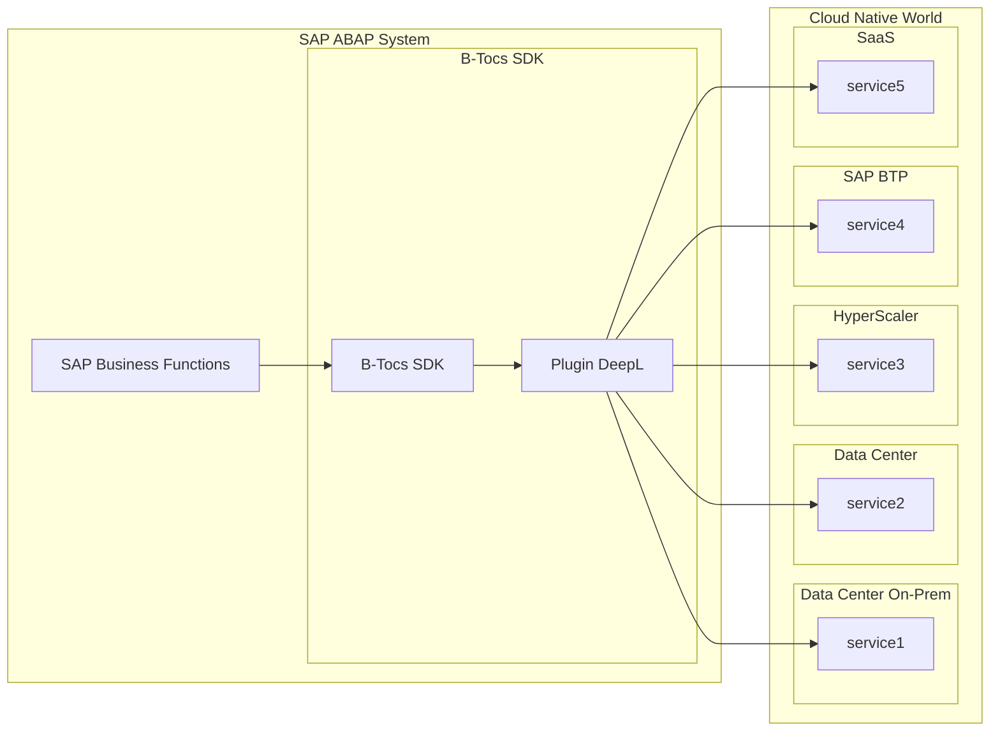
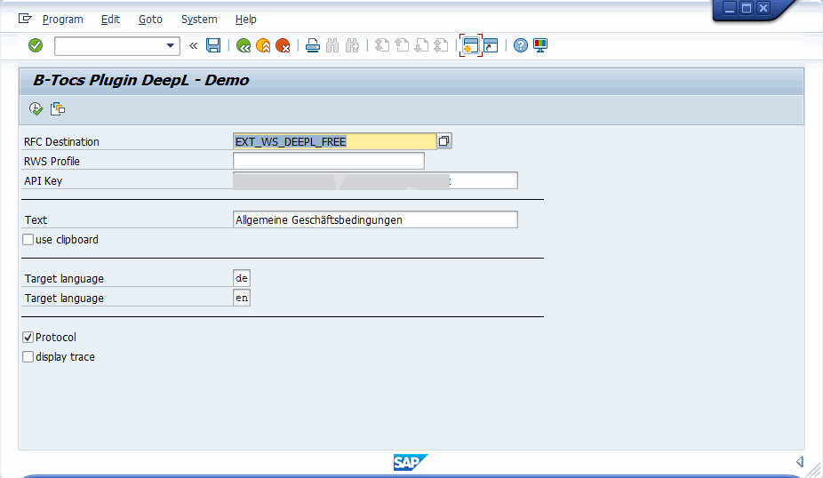
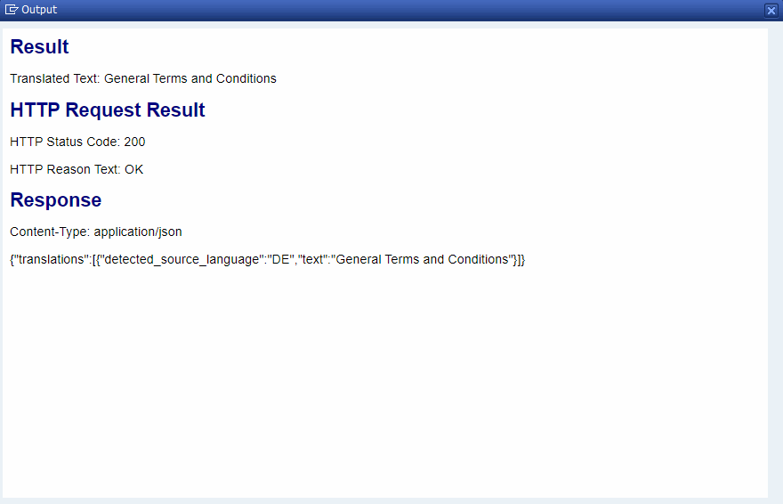
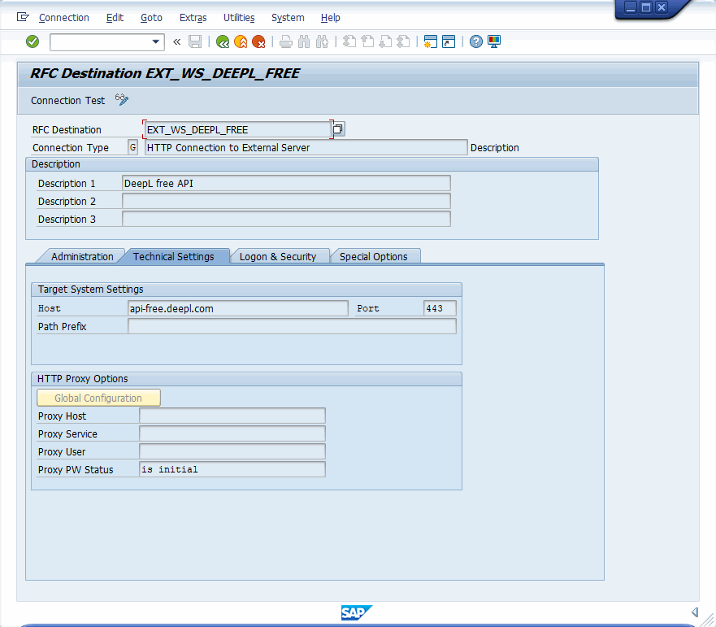
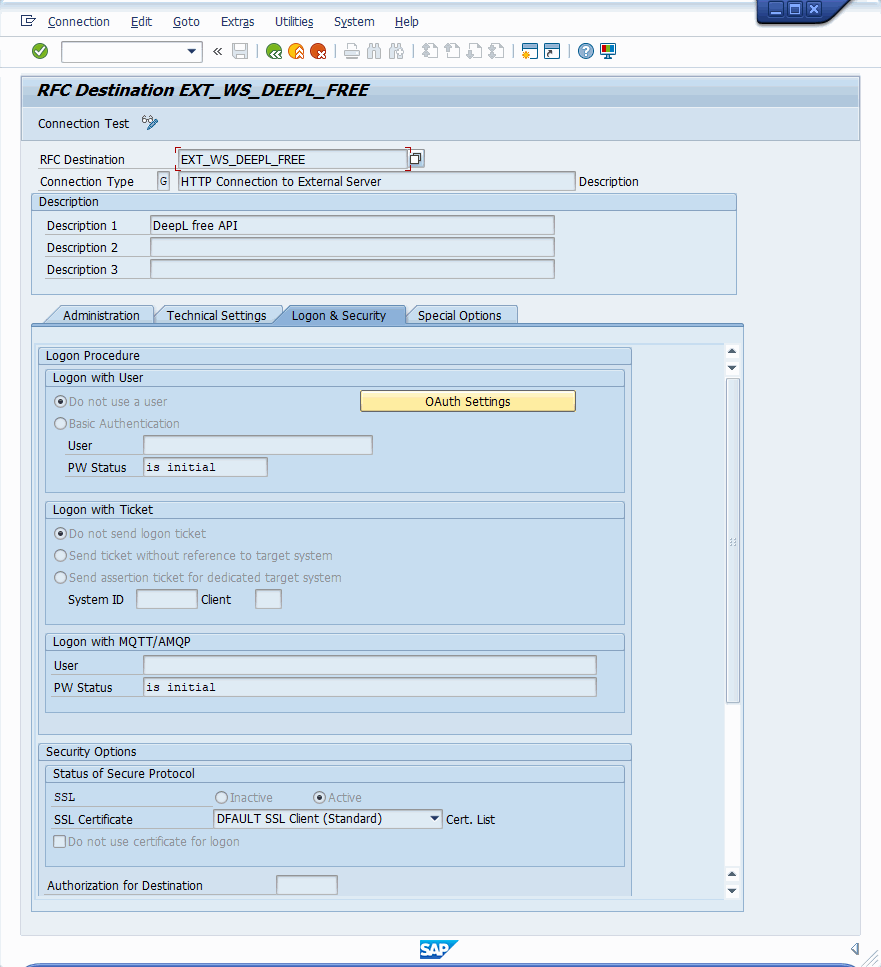

# B-Tocs ABAP Addon Plugin - DeepL Connector

## Summary

This plugin is based on the [B-Tocs ABAP SDK](https://github.com/b-tocs/abap_btocs_core) and enables the SAP ABAP Server to use the [DeepL Translation Services](https://www.deepl.com).

The plugin is free at your own risk. 
MIT License.

## Architecture

## Screenshots

### Demo 
#### Report Parameters

#### Report Result

### SM59 configuration

#### Technical Settings

#### Logon & Security

## Installation & Configuration

### 1. DeepL Account

1. Get a [free DeepL account](https://www.deepl.com)
2. Get an api key

### 2. Prepare your SAP ABAP Backend
1. An installed [B-Tocs ABAP SDK](https://github.com/b-tocs/abap_btocs_core) is required. Check for Updates.
2. Install this plugin with [abapGit](https://abapgit.org).
3. Use Package ZBTOCS_DEEPL or $BTOCS_DEEPL (local only)
4. Configure SM59 RFC Destination to your service (see screenshots, activate SSL)
5. Test the connection - Create or update STRUST with the current DeepL certificate
6. Execute program ZBTOCS_DEEPL_GUI_RWS_DEMO for a demo (enter your api key)

## Known Issues
1. Known issues with backward compatibility. Check the latest version of your B-Tocs ABAP SDK
